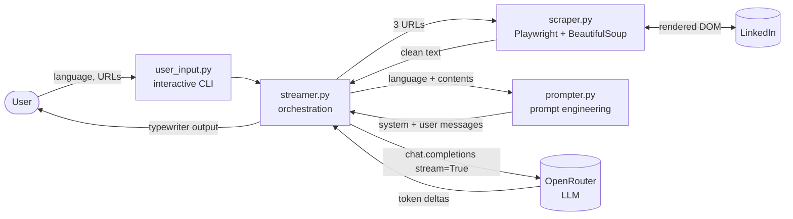

# HireWhy

**Turn a LinkedIn profile and a job posting into a persuasive, first-person case for why *you* are the right hire, in the language of your choice.**

HireWhy reads a candidate's LinkedIn profile, their full *Experience* section and a LinkedIn job posting. It then uses a large language model acting as a career coach to write a structured argument that connects the candidate's track record to the role's requirements, point by point.

## Business value

| For | Value |
|---|---|
| **Job seekers** | Get a tailored pitch for each application in seconds instead of rewriting a cover letter from scratch. The argument draws on the candidate's real, detailed experience rather than a generic template. |
| **Recruiters & career coaches** | Quickly surface the strongest candidate-to-role fit arguments, useful for preparing shortlists, interviews or candidate presentations to hiring managers. |
| **International hiring** | Output in English, Spanish, Italian, German or French, whatever the language of the source pages. |

---

## Features

- **LinkedIn-aware scraping of dynamic pages.** A real Chromium browser (Playwright) renders client-side JavaScript, waits for the network to settle and scrolls until lazy-loaded sections appear. This way the model sees the whole page and not an empty shell.
- **Login-wall handling with session persistence.** When LinkedIn asks for authentication, HireWhy opens a visible browser window and waits for you to log in (2FA included). The session is saved in a local browser profile, so later runs stay headless and fully automatic.
- **Full experience context.** The scraper automatically derives the `/details/experience/` URL from the profile URL, so the model sees every position and not only the truncated summary on the main profile.
- **Multilingual output.** You choose the coach's language from an interactive menu, and it is applied in both the system and user prompts.
- **Real-time streaming.** The answer is streamed token by token to the terminal with the familiar "typewriter" effect, so the first words appear within seconds.
- **Provider-agnostic LLM access.** Built on the OpenAI SDK pointed at [OpenRouter](https://openrouter.ai), so switching models or providers is a one-line change.
- **Markdown output.** The case is returned as clean Markdown, ready to paste into an email, a cover letter or a notes app.

---

## Getting started (local)

### Prerequisites

- **Python 3.13+**
- **[uv](https://docs.astral.sh/uv/)** (recommended) or `pip`
- An **[OpenRouter](https://openrouter.ai) API key**
- A **LinkedIn account** (you will be asked to log in once)

### 1. Clone and install dependencies

```bash
git clone <repository-url> hirewhy
cd hirewhy
uv sync
```

<details>
<summary>Without uv</summary>

```bash
python -m venv .venv
# Windows: .venv\Scripts\activate    macOS/Linux: source .venv/bin/activate
pip install beautifulsoup4 openai playwright python-dotenv requests
```
</details>

### 2. Install the Playwright browser

```bash
uv run playwright install chromium
```

### 3. Configure environment variables

Create a `.env` file at the project root:

```dotenv
OPENROUTER_API_KEY=sk-or-...
OPENROUTER_BASE_URL=https://openrouter.ai/api/v1
```

`.env` is git-ignored. Never commit your key.

### 4. Run

```bash
uv run main.py
```

Then follow the prompts:

```text
What language would you like the professional career coach to speak?
  1. English
  2. Spanish
  3. Italian
  4. German
  5. French
Your choice: 1
Enter your LinkedIn profile URL: https://www.linkedin.com/in/your-handle/
Enter the LinkedIn URL for the job description: https://www.linkedin.com/jobs/view/1234567890/
```

**First run:** a Chromium window opens on the LinkedIn login page. Log in normally and the page is captured automatically once you are through (you have 5 minutes). Your session is stored in `.browser_profile/` (git-ignored), so later runs are fully headless.

The compelling case then streams into the terminal.

### Exploring in Jupyter

`lab.ipynb` is the prototyping notebook the modules were extracted from. It includes a non-streaming variant that renders the result as formatted Markdown. The scraper runs Playwright in a dedicated thread with its own event loop, so it works inside Jupyter's already-running event loop, including on Windows.

---

## Architecture



### Modules

| File | Responsibility |
|---|---|
| [main.py](main.py) | Entry point. |
| [streamer.py](streamer.py) | Orchestrates the pipeline: collects input, scrapes the three pages, builds the messages, calls the LLM with `stream=True` and prints deltas as they arrive. |
| [scraper.py](scraper.py) | Turns a URL into LLM-ready text. It renders the page headlessly, detects login walls, falls back to interactive login, scrolls to load lazy content, strips noise (`script`, `style`, `img`, `input`) and returns the title plus the visible text. A static `requests` mode is also available. |
| [prompter.py](prompter.py) | Prompt layer: a parameterised **system prompt** (persona, task, output format) and **user prompt** (the three scraped contexts plus the restated instruction), assembled into chat messages. |
| [user_input.py](user_input.py) | Reusable, validated numbered-choice prompt for the terminal. |
| [lab.ipynb](lab.ipynb) | Experimentation notebook. |

### Request flow

1. **Input:** the user picks a language and provides the profile URL and the job-posting URL.
2. **Acquisition:** `fetch_website_contents` is called for the profile, the experience page and the job posting. Each call runs Playwright in an isolated thread and event loop (a `ProactorEventLoop` on Windows).
3. **Cleaning:** BeautifulSoup removes non-textual elements, which keeps the token count down and removes noise from the context.
4. **Prompt assembly:** `get_messages` combines the persona and constraints (system prompt) with the grounded context and task (user prompt).
5. **Generation:** the OpenAI-compatible client sends the messages to OpenRouter and iterates over the streamed chunks, skipping empty deltas.
6. **Output:** tokens are flushed to stdout as they arrive, and the full response is also returned for downstream use.

### Tech stack

`Python 3.13` · `OpenAI Python SDK` · `OpenRouter` · `Playwright (Chromium)` · `BeautifulSoup4` · `Requests` · `python-dotenv` · `uv` · `Jupyter`

---

## AI engineering skills demonstrated

This project is small on purpose, but it covers the full lifecycle of a production-style LLM feature: **getting good data in, steering the model, and getting a good experience out.**

### Prompt engineering
- **Role prompting:** the model plays a professional career coach who speaks the target language, which sets both tone and expertise.
- **Separation of concerns between system and user prompts:** the system prompt defines persona, method and output format, while the user prompt carries the variable, grounded context.
- **Instruction reinforcement:** the task is restated after the long context, so the instruction is not lost behind several thousand tokens of scraped content.
- **Output-format control:** the prompt enforces first-person voice, "airtight logic" argumentation and raw Markdown with no code-fence wrapping, so the output is directly usable.
- **Parameterised, testable prompts:** prompts are pure functions of their inputs and live in their own module, so they can be versioned, reviewed and evaluated on their own.

### Context engineering and grounding (RAG-style)
- The generation is **grounded in real, freshly retrieved documents**, which reduces hallucinated experience and keeps the pitch factual.
- **Deliberate context selection:** the full experience sub-page is added on top of the profile, because it is where the real evidence lives.
- **Context cleaning:** noisy markup is stripped before it reaches the model, which improves signal-to-noise and lowers cost.

### Data acquisition for LLMs
- Scraping of **JavaScript-rendered, authenticated pages** with a headless browser, idle-network waiting and infinite-scroll handling.
- **Human-in-the-loop authentication** with a persistent browser context. This is a practical pattern for agents that need to act on behalf of a user.
- Robust **async and concurrency handling**: the Playwright coroutine runs in a dedicated thread with its own event loop, which makes it safe in scripts and in notebooks, with a platform-specific fix for Windows.

### LLM integration and UX
- **Token streaming** over the Chat Completions API for low perceived latency.
- **Vendor-neutral model access** through an OpenAI-compatible gateway (OpenRouter), so it is easy to benchmark models or switch for cost or quality.
- **Secrets management** with environment variables and `.env`.

### Engineering practice
- A path **from notebook prototype to modular code** (see the git history), with single-responsibility modules.
- Reproducible environments with **uv** and a lock file.

---

## Roadmap

- Graceful error handling and retries when a page cannot be scraped
- Configurable model selection (CLI flag / env var) and local models through Ollama
- Web UI (e.g. Gradio or Streamlit)
- Automated evaluation of output quality (LLM-as-a-judge, factual-consistency checks against the scraped profile)
- Structured extraction of skills and requirements before generation, for an explicit match matrix

## Disclaimer

HireWhy is a personal, educational project. Scraping LinkedIn may conflict with LinkedIn's User Agreement. Only use it with your own account and your own data, at a reasonable rate. Always review generated content before you send it to an employer.
